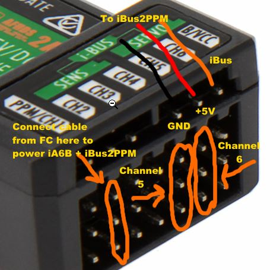
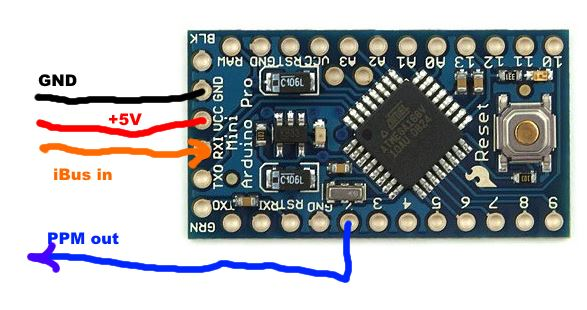

# Using Flysky i6 / TGY-i6 as a 10 channel transmiter

The Flysky i6 transmitter, sold under many names, is a normal RC transmitter.
It has a CPU, some memory, and a radio + some sticks, switches etc. 
It is sold with firmware limiting it to 6 channels output, and it is sold witht he ia6
receiver.

On rcgroups.com in the thread http://www.rcgroups.com/forums/showthread.php?t=2486545 
there has been talk ongoing on how to "hack" the firmware to support more channels,
since it was found that the iA6B Rx outputs 14 channels over iBus.

D.Borthwick made the best 10 channel firmware so far, which not only does 10 channels,
but he also changed some of the screens, and allows you to use 2 buttons as 1. 
I used SwC+SwD as one 6 channel switch for flight modes. No need to use the mixer etc.

Benb0jangles is hosting the latest firmwares on github here:
https://github.com/benb0jangles/FlySky-i6-Mod-/tree/master/10ch%20Mod%20i6%20Updater

CleanFlight/BetaFlight is now supporting iBus directly, at the cost of using one
serial port for this (you would lose the port used for GPS). 

The iA6B Rx will output the first 6 channels as PWM, and all channels over iBus. If set
to PPM output, it will output 6 channels only over PPM.

APM and other flight controllers might not support iBus. It is unlikely it will
get backported to Arducopter on APM hardware.

This is why I created iBus2PPM.

## iBus2PPM

iBus2PPM uses any 16MHz Arduino to convert iBus to PPM, which can happily be fed
into most flight controllers. It will also remap channels 5+6 if wanted. 

There is an option to use variable frame size to get 1 update every
15ms instead of 1 every 22.5ms, which is the standard for 8 channel PPM, 
cutting 30% off the latency. iBus is still faster with one update every 7.5ms.
The default is to not use variable frames, as this breaks compatibility with APM/Pixhawk,
but it is tested and working on BaseFlight/CleanFlight/Betaflight (who all supports iBus as well)

Since I use the combined SwC+SwD switch, I have only 9 possible inputs, so most
users can limit number of PPM channels to 9. Since I need 2 channels for pan/til
of camera, I need only to pass 7 channels over PPM. Every channel saved is 1.5ms 
saved in latency.

To get my pan/til channels as PWM, I send them as channel 5+6, Then I can use the 
PWM output directly fromthe iA6B. Then I have the code swap channels 5+6 with 
channels 8+9.  Channels 8+9 is thus remapped, and will appear as channels 5+6 on the 
flight controller (Arducopter always uses channel 5 for flight modes).

The onboard LED blinks when it sees a packet with failed checksum. Should not happen
as far as I know, as I would expect the iA6B to transmit only correct packets.

As for failsafe values, remember to set those up on the TX. And set up the flight controller
to handle it (like trigger RTH). The FS-i6 will not allow a failsafe outside the normal
stick range, so if you need a lower value, like 950, I have added code that checks if 
all of channels 1..6 are at 1020 or lower. So set failsafe on all these channels to -100,
and we will detech failsafe mode, and output failsafe values over PPM.

## Installing iBus2PPM

Installing software on Arduino is done the usual way. If you already have a standard Arduino,
or FTDI cable you can use to flash the Arduino, I recommend an Arduino Pro Mini clone.
They are less than $1.50 on eBay. They are come without a USB->Serial chip, and are smaller
and lighter. On top of that the advantage of the Pro Mini is the pinout. It has
the 3 pins GND, 5V, RX next to each other on the end connector, so easy to connect with a 
standard 3-wire cable + 1 cable for PPM out. But any Arduino can be used.
I soldered in angled pins at the end, and a few pins around D2 (PPM out) to help protect it.

It is important to ensure flight controller, pixhawk and receiver (iA6B) share a common GND connection. More so if you use USB connection to the flight controller, as the 0 of the computer and the battery are completely indenpendent otherwise.

In the plane/copter everything should share a common ground, and you should try to avoid ground loop. Especially in a copter you can minimize noise by making sure no ESC has any ground connection to the FC, as it already is grounded on the fat black wire going into it. In a plane this is not that important, but you might get away with removing the GND pin from the UBEC connector if you use a power module, as you would get GND that way - But this is not common practice for planes, where people might want to remove the FC/Power module and fly with the Rx only.

Here is how to connect the iA6B:



And how to connect the Pro Mini



## Things to adjust in the source code

```
#define PPM_CHANS 9  // The number of PPM channels you want passed to the flight controller

#define SWAPCH5 8   // What channels to swap with channel 5. Can be 5 for no remapping
#define SWAPCH6 9   // What channels to swap with channel 6. Can be 6 for no remapping
```

If the midpoint of the channels are not 1500, you can adjust
`#define PPM_offset -7`
The value of -7 means that my outputs were 1507. So subtract 7 to reach 1500.

Endpoint adjustments is done on the transmitter. You need to know, that to adjust the high
end of channel 1+2+4, you need to actually hold the stick there, when pressing down to
reach the channel, or it will only allow you to adjust low endpoint. Do this when connected
to the flight controller. I am around 105% at both ends to get values 1000..2000.

